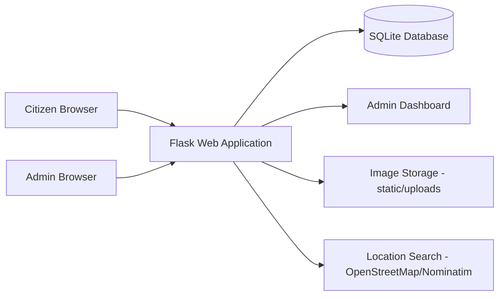

# CivicConnect System Architecture

```mermaid
flowchart LR
    A[Citizen Browser] --> B[Flask Web Application]
    B --> C[(SQLite Database)]
    D[Admin Browser] --> B
    B --> E[Admin Dashboard]
    B --> F[Image Storage - static/uploads]
    B --> G[Location Search - OpenStreetMap/Nominatim]
```
